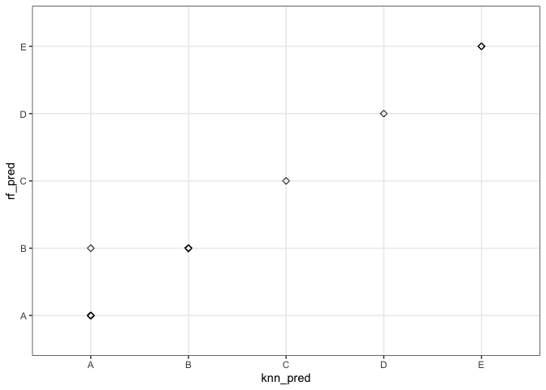

# Summary
In this report we will attempt to predict whether a barbell lift was performed
correctly or not using different measurements from accelerometers on the belt, 
forearm, arm, and dumbell of 6 participants. They were asked to perform barbell 
lifts correctly and incorrectly in 5 different ways. More information is 
available from the website [here](http://groupware.les.inf.puc-rio.br/har) 
(see the section on the Weight Lifting Exercise Dataset). We used a KNN model
which helped us predict the test data with 95% accuracy!

# Requirements
Load necessary libraries:

```r
library(data.table)
library(tidyr)
library(ggplot2)
library(dplyr)
library(lubridate)
library(R.utils)
library(caret)
```

Display session info:

```r
sessionInfo()
```

```
## R version 4.0.2 (2020-06-22)
## Platform: x86_64-apple-darwin17.0 (64-bit)
## Running under: macOS Catalina 10.15.6
## 
## Matrix products: default
## BLAS:   /Library/Frameworks/R.framework/Versions/4.0/Resources/lib/libRblas.dylib
## LAPACK: /Library/Frameworks/R.framework/Versions/4.0/Resources/lib/libRlapack.dylib
## 
## locale:
## [1] en_US.UTF-8/en_US.UTF-8/en_US.UTF-8/C/en_US.UTF-8/en_US.UTF-8
## 
## attached base packages:
## [1] stats     graphics  grDevices utils     datasets  methods   base     
## 
## other attached packages:
##  [1] caret_6.0-86      lattice_0.20-41   R.utils_2.9.2     R.oo_1.23.0      
##  [5] R.methodsS3_1.8.0 lubridate_1.7.9   dplyr_1.0.1       ggplot2_3.3.2    
##  [9] tidyr_1.1.1       data.table_1.13.0
## 
## loaded via a namespace (and not attached):
##  [1] tidyselect_1.1.0     xfun_0.16            purrr_0.3.4         
##  [4] reshape2_1.4.4       splines_4.0.2        colorspace_1.4-1    
##  [7] vctrs_0.3.4          generics_0.0.2       stats4_4.0.2        
## [10] htmltools_0.5.0      yaml_2.2.1           survival_3.2-3      
## [13] prodlim_2019.11.13   rlang_0.4.7          ModelMetrics_1.2.2.2
## [16] pillar_1.4.6         glue_1.4.2           withr_2.2.0         
## [19] foreach_1.5.0        lifecycle_0.2.0      plyr_1.8.6          
## [22] lava_1.6.7           stringr_1.4.0        timeDate_3043.102   
## [25] munsell_0.5.0        gtable_0.3.0         recipes_0.1.13      
## [28] codetools_0.2-16     evaluate_0.14        knitr_1.29          
## [31] class_7.3-17         Rcpp_1.0.5           scales_1.1.1        
## [34] ipred_0.9-9          digest_0.6.25        stringi_1.4.6       
## [37] grid_4.0.2           tools_4.0.2          magrittr_1.5        
## [40] tibble_3.0.3         crayon_1.3.4         pkgconfig_2.0.3     
## [43] ellipsis_0.3.1       MASS_7.3-51.6        Matrix_1.2-18       
## [46] pROC_1.16.2          gower_0.2.2          rmarkdown_2.3       
## [49] iterators_1.0.12     R6_2.4.1             rpart_4.1-15        
## [52] nnet_7.3-14          nlme_3.1-148         compiler_4.0.2
```

# Data Processing
1. Read the train and test data from the urls, no need to download them.
2. Convert the dataframes to tibbles for easier handling.

```r
train_url <- "https://d396qusza40orc.cloudfront.net/predmachlearn/pml-training.csv"
test_url <- "https://d396qusza40orc.cloudfront.net/predmachlearn/pml-testing.csv"
train_data <- fread(train_url)
test_data <- fread(test_url)
train_data <- as_tibble(train_data)
test_data <- as_tibble(test_data)
#train_data$Date <- as.Date(train_data$cvtd_timestamp, format="%d/%m/%Y")
#train_data$Time <- as_datetime(train_data$cvtd_timestamp, format="%d/%m/%Y %H:%M")
```

## Exploratory Data Analysis (EDA)
Let's take a look at the data:

```r
str(train_data)
```

```
## tibble [19,622 × 160] (S3: tbl_df/tbl/data.frame)
##  $ V1                      : int [1:19622] 1 2 3 4 5 6 7 8 9 10 ...
##  $ user_name               : chr [1:19622] "carlitos" "carlitos" "carlitos" "carlitos" ...
##  $ raw_timestamp_part_1    : int [1:19622] 1323084231 1323084231 1323084231 1323084232 1323084232 1323084232 1323084232 1323084232 1323084232 1323084232 ...
##  $ raw_timestamp_part_2    : int [1:19622] 788290 808298 820366 120339 196328 304277 368296 440390 484323 484434 ...
##  $ cvtd_timestamp          : chr [1:19622] "05/12/2011 11:23" "05/12/2011 11:23" "05/12/2011 11:23" "05/12/2011 11:23" ...
##  $ new_window              : chr [1:19622] "no" "no" "no" "no" ...
##  $ num_window              : int [1:19622] 11 11 11 12 12 12 12 12 12 12 ...
##  $ roll_belt               : num [1:19622] 1.41 1.41 1.42 1.48 1.48 1.45 1.42 1.42 1.43 1.45 ...
##  $ pitch_belt              : num [1:19622] 8.07 8.07 8.07 8.05 8.07 8.06 8.09 8.13 8.16 8.17 ...
##  $ yaw_belt                : num [1:19622] -94.4 -94.4 -94.4 -94.4 -94.4 -94.4 -94.4 -94.4 -94.4 -94.4 ...
##  $ total_accel_belt        : int [1:19622] 3 3 3 3 3 3 3 3 3 3 ...
##  $ kurtosis_roll_belt      : num [1:19622] NA NA NA NA NA NA NA NA NA NA ...
##  $ kurtosis_picth_belt     : num [1:19622] NA NA NA NA NA NA NA NA NA NA ...
##  $ kurtosis_yaw_belt       : num [1:19622] NA NA NA NA NA NA NA NA NA NA ...
##  $ skewness_roll_belt      : num [1:19622] NA NA NA NA NA NA NA NA NA NA ...
##  $ skewness_roll_belt.1    : num [1:19622] NA NA NA NA NA NA NA NA NA NA ...
##  $ skewness_yaw_belt       : num [1:19622] NA NA NA NA NA NA NA NA NA NA ...
##  $ max_roll_belt           : num [1:19622] NA NA NA NA NA NA NA NA NA NA ...
##  $ max_picth_belt          : int [1:19622] NA NA NA NA NA NA NA NA NA NA ...
##  $ max_yaw_belt            : num [1:19622] NA NA NA NA NA NA NA NA NA NA ...
##  $ min_roll_belt           : num [1:19622] NA NA NA NA NA NA NA NA NA NA ...
##  $ min_pitch_belt          : int [1:19622] NA NA NA NA NA NA NA NA NA NA ...
##  $ min_yaw_belt            : num [1:19622] NA NA NA NA NA NA NA NA NA NA ...
##  $ amplitude_roll_belt     : num [1:19622] NA NA NA NA NA NA NA NA NA NA ...
##  $ amplitude_pitch_belt    : int [1:19622] NA NA NA NA NA NA NA NA NA NA ...
##  $ amplitude_yaw_belt      : num [1:19622] NA NA NA NA NA NA NA NA NA NA ...
##  $ var_total_accel_belt    : num [1:19622] NA NA NA NA NA NA NA NA NA NA ...
##  $ avg_roll_belt           : num [1:19622] NA NA NA NA NA NA NA NA NA NA ...
##  $ stddev_roll_belt        : num [1:19622] NA NA NA NA NA NA NA NA NA NA ...
##  $ var_roll_belt           : num [1:19622] NA NA NA NA NA NA NA NA NA NA ...
##  $ avg_pitch_belt          : num [1:19622] NA NA NA NA NA NA NA NA NA NA ...
##  $ stddev_pitch_belt       : num [1:19622] NA NA NA NA NA NA NA NA NA NA ...
##  $ var_pitch_belt          : num [1:19622] NA NA NA NA NA NA NA NA NA NA ...
##  $ avg_yaw_belt            : num [1:19622] NA NA NA NA NA NA NA NA NA NA ...
##  $ stddev_yaw_belt         : num [1:19622] NA NA NA NA NA NA NA NA NA NA ...
##  $ var_yaw_belt            : num [1:19622] NA NA NA NA NA NA NA NA NA NA ...
##  $ gyros_belt_x            : num [1:19622] 0 0.02 0 0.02 0.02 0.02 0.02 0.02 0.02 0.03 ...
##  $ gyros_belt_y            : num [1:19622] 0 0 0 0 0.02 0 0 0 0 0 ...
##  $ gyros_belt_z            : num [1:19622] -0.02 -0.02 -0.02 -0.03 -0.02 -0.02 -0.02 -0.02 -0.02 0 ...
##  $ accel_belt_x            : int [1:19622] -21 -22 -20 -22 -21 -21 -22 -22 -20 -21 ...
##  $ accel_belt_y            : int [1:19622] 4 4 5 3 2 4 3 4 2 4 ...
##  $ accel_belt_z            : int [1:19622] 22 22 23 21 24 21 21 21 24 22 ...
##  $ magnet_belt_x           : int [1:19622] -3 -7 -2 -6 -6 0 -4 -2 1 -3 ...
##  $ magnet_belt_y           : int [1:19622] 599 608 600 604 600 603 599 603 602 609 ...
##  $ magnet_belt_z           : int [1:19622] -313 -311 -305 -310 -302 -312 -311 -313 -312 -308 ...
##  $ roll_arm                : num [1:19622] -128 -128 -128 -128 -128 -128 -128 -128 -128 -128 ...
##  $ pitch_arm               : num [1:19622] 22.5 22.5 22.5 22.1 22.1 22 21.9 21.8 21.7 21.6 ...
##  $ yaw_arm                 : num [1:19622] -161 -161 -161 -161 -161 -161 -161 -161 -161 -161 ...
##  $ total_accel_arm         : int [1:19622] 34 34 34 34 34 34 34 34 34 34 ...
##  $ var_accel_arm           : num [1:19622] NA NA NA NA NA NA NA NA NA NA ...
##  $ avg_roll_arm            : num [1:19622] NA NA NA NA NA NA NA NA NA NA ...
##  $ stddev_roll_arm         : num [1:19622] NA NA NA NA NA NA NA NA NA NA ...
##  $ var_roll_arm            : num [1:19622] NA NA NA NA NA NA NA NA NA NA ...
##  $ avg_pitch_arm           : num [1:19622] NA NA NA NA NA NA NA NA NA NA ...
##  $ stddev_pitch_arm        : num [1:19622] NA NA NA NA NA NA NA NA NA NA ...
##  $ var_pitch_arm           : num [1:19622] NA NA NA NA NA NA NA NA NA NA ...
##  $ avg_yaw_arm             : num [1:19622] NA NA NA NA NA NA NA NA NA NA ...
##  $ stddev_yaw_arm          : num [1:19622] NA NA NA NA NA NA NA NA NA NA ...
##  $ var_yaw_arm             : num [1:19622] NA NA NA NA NA NA NA NA NA NA ...
##  $ gyros_arm_x             : num [1:19622] 0 0.02 0.02 0.02 0 0.02 0 0.02 0.02 0.02 ...
##  $ gyros_arm_y             : num [1:19622] 0 -0.02 -0.02 -0.03 -0.03 -0.03 -0.03 -0.02 -0.03 -0.03 ...
##  $ gyros_arm_z             : num [1:19622] -0.02 -0.02 -0.02 0.02 0 0 0 0 -0.02 -0.02 ...
##  $ accel_arm_x             : int [1:19622] -288 -290 -289 -289 -289 -289 -289 -289 -288 -288 ...
##  $ accel_arm_y             : int [1:19622] 109 110 110 111 111 111 111 111 109 110 ...
##  $ accel_arm_z             : int [1:19622] -123 -125 -126 -123 -123 -122 -125 -124 -122 -124 ...
##  $ magnet_arm_x            : int [1:19622] -368 -369 -368 -372 -374 -369 -373 -372 -369 -376 ...
##  $ magnet_arm_y            : int [1:19622] 337 337 344 344 337 342 336 338 341 334 ...
##  $ magnet_arm_z            : int [1:19622] 516 513 513 512 506 513 509 510 518 516 ...
##  $ kurtosis_roll_arm       : num [1:19622] NA NA NA NA NA NA NA NA NA NA ...
##  $ kurtosis_picth_arm      : num [1:19622] NA NA NA NA NA NA NA NA NA NA ...
##  $ kurtosis_yaw_arm        : num [1:19622] NA NA NA NA NA NA NA NA NA NA ...
##  $ skewness_roll_arm       : num [1:19622] NA NA NA NA NA NA NA NA NA NA ...
##  $ skewness_pitch_arm      : num [1:19622] NA NA NA NA NA NA NA NA NA NA ...
##  $ skewness_yaw_arm        : num [1:19622] NA NA NA NA NA NA NA NA NA NA ...
##  $ max_roll_arm            : num [1:19622] NA NA NA NA NA NA NA NA NA NA ...
##  $ max_picth_arm           : num [1:19622] NA NA NA NA NA NA NA NA NA NA ...
##  $ max_yaw_arm             : int [1:19622] NA NA NA NA NA NA NA NA NA NA ...
##  $ min_roll_arm            : num [1:19622] NA NA NA NA NA NA NA NA NA NA ...
##  $ min_pitch_arm           : num [1:19622] NA NA NA NA NA NA NA NA NA NA ...
##  $ min_yaw_arm             : int [1:19622] NA NA NA NA NA NA NA NA NA NA ...
##  $ amplitude_roll_arm      : num [1:19622] NA NA NA NA NA NA NA NA NA NA ...
##  $ amplitude_pitch_arm     : num [1:19622] NA NA NA NA NA NA NA NA NA NA ...
##  $ amplitude_yaw_arm       : int [1:19622] NA NA NA NA NA NA NA NA NA NA ...
##  $ roll_dumbbell           : num [1:19622] 13.1 13.1 12.9 13.4 13.4 ...
##  $ pitch_dumbbell          : num [1:19622] -70.5 -70.6 -70.3 -70.4 -70.4 ...
##  $ yaw_dumbbell            : num [1:19622] -84.9 -84.7 -85.1 -84.9 -84.9 ...
##  $ kurtosis_roll_dumbbell  : num [1:19622] NA NA NA NA NA NA NA NA NA NA ...
##  $ kurtosis_picth_dumbbell : num [1:19622] NA NA NA NA NA NA NA NA NA NA ...
##  $ kurtosis_yaw_dumbbell   : num [1:19622] NA NA NA NA NA NA NA NA NA NA ...
##  $ skewness_roll_dumbbell  : num [1:19622] NA NA NA NA NA NA NA NA NA NA ...
##  $ skewness_pitch_dumbbell : num [1:19622] NA NA NA NA NA NA NA NA NA NA ...
##  $ skewness_yaw_dumbbell   : num [1:19622] NA NA NA NA NA NA NA NA NA NA ...
##  $ max_roll_dumbbell       : num [1:19622] NA NA NA NA NA NA NA NA NA NA ...
##  $ max_picth_dumbbell      : num [1:19622] NA NA NA NA NA NA NA NA NA NA ...
##  $ max_yaw_dumbbell        : num [1:19622] NA NA NA NA NA NA NA NA NA NA ...
##  $ min_roll_dumbbell       : num [1:19622] NA NA NA NA NA NA NA NA NA NA ...
##  $ min_pitch_dumbbell      : num [1:19622] NA NA NA NA NA NA NA NA NA NA ...
##  $ min_yaw_dumbbell        : num [1:19622] NA NA NA NA NA NA NA NA NA NA ...
##  $ amplitude_roll_dumbbell : num [1:19622] NA NA NA NA NA NA NA NA NA NA ...
##   [list output truncated]
##  - attr(*, ".internal.selfref")=<externalptr>
```

```r
summary(train_data)
```

```
##        V1         user_name         raw_timestamp_part_1 raw_timestamp_part_2
##  Min.   :    1   Length:19622       Min.   :1.322e+09    Min.   :   294      
##  1st Qu.: 4906   Class :character   1st Qu.:1.323e+09    1st Qu.:252912      
##  Median : 9812   Mode  :character   Median :1.323e+09    Median :496380      
##  Mean   : 9812                      Mean   :1.323e+09    Mean   :500656      
##  3rd Qu.:14717                      3rd Qu.:1.323e+09    3rd Qu.:751891      
##  Max.   :19622                      Max.   :1.323e+09    Max.   :998801      
##                                                                              
##  cvtd_timestamp      new_window          num_window      roll_belt     
##  Length:19622       Length:19622       Min.   :  1.0   Min.   :-28.90  
##  Class :character   Class :character   1st Qu.:222.0   1st Qu.:  1.10  
##  Mode  :character   Mode  :character   Median :424.0   Median :113.00  
##                                        Mean   :430.6   Mean   : 64.41  
##                                        3rd Qu.:644.0   3rd Qu.:123.00  
##                                        Max.   :864.0   Max.   :162.00  
##                                                                        
##    pitch_belt          yaw_belt       total_accel_belt kurtosis_roll_belt
##  Min.   :-55.8000   Min.   :-180.00   Min.   : 0.00    Min.   :-2.121    
##  1st Qu.:  1.7600   1st Qu.: -88.30   1st Qu.: 3.00    1st Qu.:-1.329    
##  Median :  5.2800   Median : -13.00   Median :17.00    Median :-0.899    
##  Mean   :  0.3053   Mean   : -11.21   Mean   :11.31    Mean   :-0.220    
##  3rd Qu.: 14.9000   3rd Qu.:  12.90   3rd Qu.:18.00    3rd Qu.:-0.219    
##  Max.   : 60.3000   Max.   : 179.00   Max.   :29.00    Max.   :33.000    
##                                                        NA's   :19226     
##  kurtosis_picth_belt kurtosis_yaw_belt skewness_roll_belt skewness_roll_belt.1
##  Min.   :-2.190      Min.   : NA       Min.   :-5.745     Min.   :-7.616      
##  1st Qu.:-1.107      1st Qu.: NA       1st Qu.:-0.444     1st Qu.:-1.114      
##  Median :-0.151      Median : NA       Median : 0.000     Median :-0.068      
##  Mean   : 4.334      Mean   :NaN       Mean   :-0.026     Mean   :-0.296      
##  3rd Qu.: 3.178      3rd Qu.: NA       3rd Qu.: 0.417     3rd Qu.: 0.661      
##  Max.   :58.000      Max.   : NA       Max.   : 3.595     Max.   : 7.348      
##  NA's   :19248       NA's   :19622     NA's   :19225      NA's   :19248       
##  skewness_yaw_belt max_roll_belt     max_picth_belt   max_yaw_belt  
##  Min.   : NA       Min.   :-94.300   Min.   : 3.00   Min.   :-2.10  
##  1st Qu.: NA       1st Qu.:-88.000   1st Qu.: 5.00   1st Qu.:-1.30  
##  Median : NA       Median : -5.100   Median :18.00   Median :-0.90  
##  Mean   :NaN       Mean   : -6.667   Mean   :12.92   Mean   :-0.22  
##  3rd Qu.: NA       3rd Qu.: 18.500   3rd Qu.:19.00   3rd Qu.:-0.20  
##  Max.   : NA       Max.   :180.000   Max.   :30.00   Max.   :33.00  
##  NA's   :19622     NA's   :19216     NA's   :19216   NA's   :19226  
##  min_roll_belt     min_pitch_belt   min_yaw_belt   amplitude_roll_belt
##  Min.   :-180.00   Min.   : 0.00   Min.   :-2.10   Min.   :  0.000    
##  1st Qu.: -88.40   1st Qu.: 3.00   1st Qu.:-1.30   1st Qu.:  0.300    
##  Median :  -7.85   Median :16.00   Median :-0.90   Median :  1.000    
##  Mean   : -10.44   Mean   :10.76   Mean   :-0.22   Mean   :  3.769    
##  3rd Qu.:   9.05   3rd Qu.:17.00   3rd Qu.:-0.20   3rd Qu.:  2.082    
##  Max.   : 173.00   Max.   :23.00   Max.   :33.00   Max.   :360.000    
##  NA's   :19216     NA's   :19216   NA's   :19226   NA's   :19216      
##  amplitude_pitch_belt amplitude_yaw_belt var_total_accel_belt avg_roll_belt   
##  Min.   : 0.000       Min.   :0          Min.   : 0.000       Min.   :-27.40  
##  1st Qu.: 1.000       1st Qu.:0          1st Qu.: 0.100       1st Qu.:  1.10  
##  Median : 1.000       Median :0          Median : 0.200       Median :116.35  
##  Mean   : 2.167       Mean   :0          Mean   : 0.926       Mean   : 68.06  
##  3rd Qu.: 2.000       3rd Qu.:0          3rd Qu.: 0.300       3rd Qu.:123.38  
##  Max.   :12.000       Max.   :0          Max.   :16.500       Max.   :157.40  
##  NA's   :19216        NA's   :19226      NA's   :19216        NA's   :19216   
##  stddev_roll_belt var_roll_belt     avg_pitch_belt    stddev_pitch_belt
##  Min.   : 0.000   Min.   :  0.000   Min.   :-51.400   Min.   :0.000    
##  1st Qu.: 0.200   1st Qu.:  0.000   1st Qu.:  2.025   1st Qu.:0.200    
##  Median : 0.400   Median :  0.100   Median :  5.200   Median :0.400    
##  Mean   : 1.337   Mean   :  7.699   Mean   :  0.520   Mean   :0.603    
##  3rd Qu.: 0.700   3rd Qu.:  0.500   3rd Qu.: 15.775   3rd Qu.:0.700    
##  Max.   :14.200   Max.   :200.700   Max.   : 59.700   Max.   :4.000    
##  NA's   :19216    NA's   :19216     NA's   :19216     NA's   :19216    
##  var_pitch_belt    avg_yaw_belt      stddev_yaw_belt    var_yaw_belt      
##  Min.   : 0.000   Min.   :-138.300   Min.   :  0.000   Min.   :    0.000  
##  1st Qu.: 0.000   1st Qu.: -88.175   1st Qu.:  0.100   1st Qu.:    0.010  
##  Median : 0.100   Median :  -6.550   Median :  0.300   Median :    0.090  
##  Mean   : 0.766   Mean   :  -8.831   Mean   :  1.341   Mean   :  107.487  
##  3rd Qu.: 0.500   3rd Qu.:  14.125   3rd Qu.:  0.700   3rd Qu.:    0.475  
##  Max.   :16.200   Max.   : 173.500   Max.   :176.600   Max.   :31183.240  
##  NA's   :19216    NA's   :19216      NA's   :19216     NA's   :19216      
##   gyros_belt_x        gyros_belt_y       gyros_belt_z      accel_belt_x     
##  Min.   :-1.040000   Min.   :-0.64000   Min.   :-1.4600   Min.   :-120.000  
##  1st Qu.:-0.030000   1st Qu.: 0.00000   1st Qu.:-0.2000   1st Qu.: -21.000  
##  Median : 0.030000   Median : 0.02000   Median :-0.1000   Median : -15.000  
##  Mean   :-0.005592   Mean   : 0.03959   Mean   :-0.1305   Mean   :  -5.595  
##  3rd Qu.: 0.110000   3rd Qu.: 0.11000   3rd Qu.:-0.0200   3rd Qu.:  -5.000  
##  Max.   : 2.220000   Max.   : 0.64000   Max.   : 1.6200   Max.   :  85.000  
##                                                                             
##   accel_belt_y     accel_belt_z     magnet_belt_x   magnet_belt_y  
##  Min.   :-69.00   Min.   :-275.00   Min.   :-52.0   Min.   :354.0  
##  1st Qu.:  3.00   1st Qu.:-162.00   1st Qu.:  9.0   1st Qu.:581.0  
##  Median : 35.00   Median :-152.00   Median : 35.0   Median :601.0  
##  Mean   : 30.15   Mean   : -72.59   Mean   : 55.6   Mean   :593.7  
##  3rd Qu.: 61.00   3rd Qu.:  27.00   3rd Qu.: 59.0   3rd Qu.:610.0  
##  Max.   :164.00   Max.   : 105.00   Max.   :485.0   Max.   :673.0  
##                                                                    
##  magnet_belt_z       roll_arm         pitch_arm          yaw_arm         
##  Min.   :-623.0   Min.   :-180.00   Min.   :-88.800   Min.   :-180.0000  
##  1st Qu.:-375.0   1st Qu.: -31.77   1st Qu.:-25.900   1st Qu.: -43.1000  
##  Median :-320.0   Median :   0.00   Median :  0.000   Median :   0.0000  
##  Mean   :-345.5   Mean   :  17.83   Mean   : -4.612   Mean   :  -0.6188  
##  3rd Qu.:-306.0   3rd Qu.:  77.30   3rd Qu.: 11.200   3rd Qu.:  45.8750  
##  Max.   : 293.0   Max.   : 180.00   Max.   : 88.500   Max.   : 180.0000  
##                                                                          
##  total_accel_arm var_accel_arm     avg_roll_arm     stddev_roll_arm  
##  Min.   : 1.00   Min.   :  0.00   Min.   :-166.67   Min.   :  0.000  
##  1st Qu.:17.00   1st Qu.:  9.03   1st Qu.: -38.37   1st Qu.:  1.376  
##  Median :27.00   Median : 40.61   Median :   0.00   Median :  5.702  
##  Mean   :25.51   Mean   : 53.23   Mean   :  12.68   Mean   : 11.201  
##  3rd Qu.:33.00   3rd Qu.: 75.62   3rd Qu.:  76.33   3rd Qu.: 14.921  
##  Max.   :66.00   Max.   :331.70   Max.   : 163.33   Max.   :161.964  
##                  NA's   :19216    NA's   :19216     NA's   :19216    
##   var_roll_arm       avg_pitch_arm     stddev_pitch_arm var_pitch_arm     
##  Min.   :    0.000   Min.   :-81.773   Min.   : 0.000   Min.   :   0.000  
##  1st Qu.:    1.898   1st Qu.:-22.770   1st Qu.: 1.642   1st Qu.:   2.697  
##  Median :   32.517   Median :  0.000   Median : 8.133   Median :  66.146  
##  Mean   :  417.264   Mean   : -4.901   Mean   :10.383   Mean   : 195.864  
##  3rd Qu.:  222.647   3rd Qu.:  8.277   3rd Qu.:16.327   3rd Qu.: 266.576  
##  Max.   :26232.208   Max.   : 75.659   Max.   :43.412   Max.   :1884.565  
##  NA's   :19216       NA's   :19216     NA's   :19216    NA's   :19216     
##   avg_yaw_arm       stddev_yaw_arm     var_yaw_arm         gyros_arm_x      
##  Min.   :-173.440   Min.   :  0.000   Min.   :    0.000   Min.   :-6.37000  
##  1st Qu.: -29.198   1st Qu.:  2.577   1st Qu.:    6.642   1st Qu.:-1.33000  
##  Median :   0.000   Median : 16.682   Median :  278.309   Median : 0.08000  
##  Mean   :   2.359   Mean   : 22.270   Mean   : 1055.933   Mean   : 0.04277  
##  3rd Qu.:  38.185   3rd Qu.: 35.984   3rd Qu.: 1294.850   3rd Qu.: 1.57000  
##  Max.   : 152.000   Max.   :177.044   Max.   :31344.568   Max.   : 4.87000  
##  NA's   :19216      NA's   :19216     NA's   :19216                         
##   gyros_arm_y       gyros_arm_z       accel_arm_x       accel_arm_y    
##  Min.   :-3.4400   Min.   :-2.3300   Min.   :-404.00   Min.   :-318.0  
##  1st Qu.:-0.8000   1st Qu.:-0.0700   1st Qu.:-242.00   1st Qu.: -54.0  
##  Median :-0.2400   Median : 0.2300   Median : -44.00   Median :  14.0  
##  Mean   :-0.2571   Mean   : 0.2695   Mean   : -60.24   Mean   :  32.6  
##  3rd Qu.: 0.1400   3rd Qu.: 0.7200   3rd Qu.:  84.00   3rd Qu.: 139.0  
##  Max.   : 2.8400   Max.   : 3.0200   Max.   : 437.00   Max.   : 308.0  
##                                                                        
##   accel_arm_z       magnet_arm_x     magnet_arm_y     magnet_arm_z   
##  Min.   :-636.00   Min.   :-584.0   Min.   :-392.0   Min.   :-597.0  
##  1st Qu.:-143.00   1st Qu.:-300.0   1st Qu.:  -9.0   1st Qu.: 131.2  
##  Median : -47.00   Median : 289.0   Median : 202.0   Median : 444.0  
##  Mean   : -71.25   Mean   : 191.7   Mean   : 156.6   Mean   : 306.5  
##  3rd Qu.:  23.00   3rd Qu.: 637.0   3rd Qu.: 323.0   3rd Qu.: 545.0  
##  Max.   : 292.00   Max.   : 782.0   Max.   : 583.0   Max.   : 694.0  
##                                                                      
##  kurtosis_roll_arm kurtosis_picth_arm kurtosis_yaw_arm skewness_roll_arm
##  Min.   :-1.809    Min.   :-2.084     Min.   :-2.103   Min.   :-2.541   
##  1st Qu.:-1.345    1st Qu.:-1.280     1st Qu.:-1.220   1st Qu.:-0.561   
##  Median :-0.894    Median :-1.010     Median :-0.733   Median : 0.040   
##  Mean   :-0.366    Mean   :-0.542     Mean   : 0.406   Mean   : 0.068   
##  3rd Qu.:-0.038    3rd Qu.:-0.379     3rd Qu.: 0.115   3rd Qu.: 0.671   
##  Max.   :21.456    Max.   :19.751     Max.   :56.000   Max.   : 4.394   
##  NA's   :19294     NA's   :19296      NA's   :19227    NA's   :19293    
##  skewness_pitch_arm skewness_yaw_arm  max_roll_arm     max_picth_arm     
##  Min.   :-4.565     Min.   :-6.708   Min.   :-73.100   Min.   :-173.000  
##  1st Qu.:-0.618     1st Qu.:-0.743   1st Qu.: -0.175   1st Qu.:  -1.975  
##  Median :-0.035     Median :-0.133   Median :  4.950   Median :  23.250  
##  Mean   :-0.065     Mean   :-0.229   Mean   : 11.236   Mean   :  35.751  
##  3rd Qu.: 0.454     3rd Qu.: 0.344   3rd Qu.: 26.775   3rd Qu.:  95.975  
##  Max.   : 3.043     Max.   : 7.483   Max.   : 85.500   Max.   : 180.000  
##  NA's   :19296      NA's   :19227    NA's   :19216     NA's   :19216     
##   max_yaw_arm     min_roll_arm    min_pitch_arm      min_yaw_arm   
##  Min.   : 4.00   Min.   :-89.10   Min.   :-180.00   Min.   : 1.00  
##  1st Qu.:29.00   1st Qu.:-41.98   1st Qu.: -72.62   1st Qu.: 8.00  
##  Median :34.00   Median :-22.45   Median : -33.85   Median :13.00  
##  Mean   :35.46   Mean   :-21.22   Mean   : -33.92   Mean   :14.66  
##  3rd Qu.:41.00   3rd Qu.:  0.00   3rd Qu.:   0.00   3rd Qu.:19.00  
##  Max.   :65.00   Max.   : 66.40   Max.   : 152.00   Max.   :38.00  
##  NA's   :19216   NA's   :19216    NA's   :19216     NA's   :19216  
##  amplitude_roll_arm amplitude_pitch_arm amplitude_yaw_arm roll_dumbbell    
##  Min.   :  0.000    Min.   :  0.000     Min.   : 0.00     Min.   :-153.71  
##  1st Qu.:  5.425    1st Qu.:  9.925     1st Qu.:13.00     1st Qu.: -18.49  
##  Median : 28.450    Median : 54.900     Median :22.00     Median :  48.17  
##  Mean   : 32.452    Mean   : 69.677     Mean   :20.79     Mean   :  23.84  
##  3rd Qu.: 50.960    3rd Qu.:115.175     3rd Qu.:28.75     3rd Qu.:  67.61  
##  Max.   :119.500    Max.   :360.000     Max.   :52.00     Max.   : 153.55  
##  NA's   :19216      NA's   :19216       NA's   :19216                      
##  pitch_dumbbell     yaw_dumbbell      kurtosis_roll_dumbbell
##  Min.   :-149.59   Min.   :-150.871   Min.   :-2.174        
##  1st Qu.: -40.89   1st Qu.: -77.644   1st Qu.:-0.682        
##  Median : -20.96   Median :  -3.324   Median :-0.033        
##  Mean   : -10.78   Mean   :   1.674   Mean   : 0.452        
##  3rd Qu.:  17.50   3rd Qu.:  79.643   3rd Qu.: 0.940        
##  Max.   : 149.40   Max.   : 154.952   Max.   :54.998        
##                                       NA's   :19221         
##  kurtosis_picth_dumbbell kurtosis_yaw_dumbbell skewness_roll_dumbbell
##  Min.   :-2.200          Min.   : NA           Min.   :-7.384        
##  1st Qu.:-0.721          1st Qu.: NA           1st Qu.:-0.581        
##  Median :-0.133          Median : NA           Median :-0.076        
##  Mean   : 0.286          Mean   :NaN           Mean   :-0.115        
##  3rd Qu.: 0.584          3rd Qu.: NA           3rd Qu.: 0.400        
##  Max.   :55.628          Max.   : NA           Max.   : 1.958        
##  NA's   :19218           NA's   :19622         NA's   :19220         
##  skewness_pitch_dumbbell skewness_yaw_dumbbell max_roll_dumbbell
##  Min.   :-7.447          Min.   : NA           Min.   :-70.10   
##  1st Qu.:-0.525          1st Qu.: NA           1st Qu.:-27.15   
##  Median :-0.091          Median : NA           Median : 14.85   
##  Mean   :-0.035          Mean   :NaN           Mean   : 13.76   
##  3rd Qu.: 0.505          3rd Qu.: NA           3rd Qu.: 50.58   
##  Max.   : 3.769          Max.   : NA           Max.   :137.00   
##  NA's   :19217           NA's   :19622         NA's   :19216    
##  max_picth_dumbbell max_yaw_dumbbell min_roll_dumbbell min_pitch_dumbbell
##  Min.   :-112.90    Min.   :-2.20    Min.   :-149.60   Min.   :-147.00   
##  1st Qu.: -66.70    1st Qu.:-0.70    1st Qu.: -59.67   1st Qu.: -91.80   
##  Median :  40.05    Median : 0.00    Median : -43.55   Median : -66.15   
##  Mean   :  32.75    Mean   : 0.45    Mean   : -41.24   Mean   : -33.18   
##  3rd Qu.: 133.22    3rd Qu.: 0.90    3rd Qu.: -25.20   3rd Qu.:  21.20   
##  Max.   : 155.00    Max.   :55.00    Max.   :  73.20   Max.   : 120.90   
##  NA's   :19216      NA's   :19221    NA's   :19216     NA's   :19216     
##  min_yaw_dumbbell amplitude_roll_dumbbell amplitude_pitch_dumbbell
##  Min.   :-2.20    Min.   :  0.00          Min.   :  0.00          
##  1st Qu.:-0.70    1st Qu.: 14.97          1st Qu.: 17.06          
##  Median : 0.00    Median : 35.05          Median : 41.73          
##  Mean   : 0.45    Mean   : 55.00          Mean   : 65.93          
##  3rd Qu.: 0.90    3rd Qu.: 81.04          3rd Qu.: 99.55          
##  Max.   :55.00    Max.   :256.48          Max.   :273.59          
##  NA's   :19221    NA's   :19216           NA's   :19216           
##  amplitude_yaw_dumbbell total_accel_dumbbell var_accel_dumbbell
##  Min.   :0              Min.   : 0.00        Min.   :  0.000   
##  1st Qu.:0              1st Qu.: 4.00        1st Qu.:  0.378   
##  Median :0              Median :10.00        Median :  1.000   
##  Mean   :0              Mean   :13.72        Mean   :  4.388   
##  3rd Qu.:0              3rd Qu.:19.00        3rd Qu.:  3.434   
##  Max.   :0              Max.   :58.00        Max.   :230.428   
##  NA's   :19221                               NA's   :19216     
##  avg_roll_dumbbell stddev_roll_dumbbell var_roll_dumbbell  avg_pitch_dumbbell
##  Min.   :-128.96   Min.   :  0.000      Min.   :    0.00   Min.   :-70.73    
##  1st Qu.: -12.33   1st Qu.:  4.639      1st Qu.:   21.52   1st Qu.:-42.00    
##  Median :  48.23   Median : 12.204      Median :  148.95   Median :-19.91    
##  Mean   :  23.86   Mean   : 20.761      Mean   : 1020.27   Mean   :-12.33    
##  3rd Qu.:  64.37   3rd Qu.: 26.356      3rd Qu.:  694.65   3rd Qu.: 13.21    
##  Max.   : 125.99   Max.   :123.778      Max.   :15321.01   Max.   : 94.28    
##  NA's   :19216     NA's   :19216        NA's   :19216      NA's   :19216     
##  stddev_pitch_dumbbell var_pitch_dumbbell avg_yaw_dumbbell  
##  Min.   : 0.000        Min.   :   0.00    Min.   :-117.950  
##  1st Qu.: 3.482        1st Qu.:  12.12    1st Qu.: -76.696  
##  Median : 8.089        Median :  65.44    Median :  -4.505  
##  Mean   :13.147        Mean   : 350.31    Mean   :   0.202  
##  3rd Qu.:19.238        3rd Qu.: 370.11    3rd Qu.:  71.234  
##  Max.   :82.680        Max.   :6836.02    Max.   : 134.905  
##  NA's   :19216         NA's   :19216      NA's   :19216     
##  stddev_yaw_dumbbell var_yaw_dumbbell   gyros_dumbbell_x    gyros_dumbbell_y  
##  Min.   :  0.000     Min.   :    0.00   Min.   :-204.0000   Min.   :-2.10000  
##  1st Qu.:  3.885     1st Qu.:   15.09   1st Qu.:  -0.0300   1st Qu.:-0.14000  
##  Median : 10.264     Median :  105.35   Median :   0.1300   Median : 0.03000  
##  Mean   : 16.647     Mean   :  589.84   Mean   :   0.1611   Mean   : 0.04606  
##  3rd Qu.: 24.674     3rd Qu.:  608.79   3rd Qu.:   0.3500   3rd Qu.: 0.21000  
##  Max.   :107.088     Max.   :11467.91   Max.   :   2.2200   Max.   :52.00000  
##  NA's   :19216       NA's   :19216                                            
##  gyros_dumbbell_z  accel_dumbbell_x  accel_dumbbell_y  accel_dumbbell_z 
##  Min.   : -2.380   Min.   :-419.00   Min.   :-189.00   Min.   :-334.00  
##  1st Qu.: -0.310   1st Qu.: -50.00   1st Qu.:  -8.00   1st Qu.:-142.00  
##  Median : -0.130   Median :  -8.00   Median :  41.50   Median :  -1.00  
##  Mean   : -0.129   Mean   : -28.62   Mean   :  52.63   Mean   : -38.32  
##  3rd Qu.:  0.030   3rd Qu.:  11.00   3rd Qu.: 111.00   3rd Qu.:  38.00  
##  Max.   :317.000   Max.   : 235.00   Max.   : 315.00   Max.   : 318.00  
##                                                                         
##  magnet_dumbbell_x magnet_dumbbell_y magnet_dumbbell_z  roll_forearm      
##  Min.   :-643.0    Min.   :-3600     Min.   :-262.00   Min.   :-180.0000  
##  1st Qu.:-535.0    1st Qu.:  231     1st Qu.: -45.00   1st Qu.:  -0.7375  
##  Median :-479.0    Median :  311     Median :  13.00   Median :  21.7000  
##  Mean   :-328.5    Mean   :  221     Mean   :  46.05   Mean   :  33.8265  
##  3rd Qu.:-304.0    3rd Qu.:  390     3rd Qu.:  95.00   3rd Qu.: 140.0000  
##  Max.   : 592.0    Max.   :  633     Max.   : 452.00   Max.   : 180.0000  
##                                                                           
##  pitch_forearm     yaw_forearm      kurtosis_roll_forearm
##  Min.   :-72.50   Min.   :-180.00   Min.   :-1.879       
##  1st Qu.:  0.00   1st Qu.: -68.60   1st Qu.:-1.398       
##  Median :  9.24   Median :   0.00   Median :-1.119       
##  Mean   : 10.71   Mean   :  19.21   Mean   :-0.689       
##  3rd Qu.: 28.40   3rd Qu.: 110.00   3rd Qu.:-0.618       
##  Max.   : 89.80   Max.   : 180.00   Max.   :40.060       
##                                     NA's   :19300        
##  kurtosis_picth_forearm kurtosis_yaw_forearm skewness_roll_forearm
##  Min.   :-2.098         Min.   : NA          Min.   :-2.297       
##  1st Qu.:-1.376         1st Qu.: NA          1st Qu.:-0.402       
##  Median :-0.890         Median : NA          Median : 0.003       
##  Mean   : 0.419         Mean   :NaN          Mean   :-0.009       
##  3rd Qu.: 0.054         3rd Qu.: NA          3rd Qu.: 0.370       
##  Max.   :33.626         Max.   : NA          Max.   : 5.856       
##  NA's   :19301          NA's   :19622        NA's   :19299        
##  skewness_pitch_forearm skewness_yaw_forearm max_roll_forearm max_picth_forearm
##  Min.   :-5.241         Min.   : NA          Min.   :-66.60   Min.   :-151.00  
##  1st Qu.:-0.881         1st Qu.: NA          1st Qu.:  0.00   1st Qu.:   0.00  
##  Median :-0.156         Median : NA          Median : 26.80   Median : 113.00  
##  Mean   :-0.223         Mean   :NaN          Mean   : 24.49   Mean   :  81.49  
##  3rd Qu.: 0.514         3rd Qu.: NA          3rd Qu.: 45.95   3rd Qu.: 174.75  
##  Max.   : 4.464         Max.   : NA          Max.   : 89.80   Max.   : 180.00  
##  NA's   :19301          NA's   :19622        NA's   :19216    NA's   :19216    
##  max_yaw_forearm  min_roll_forearm  min_pitch_forearm min_yaw_forearm 
##  Min.   :-1.900   Min.   :-72.500   Min.   :-180.00   Min.   :-1.900  
##  1st Qu.:-1.400   1st Qu.: -6.075   1st Qu.:-175.00   1st Qu.:-1.400  
##  Median :-1.100   Median :  0.000   Median : -61.00   Median :-1.100  
##  Mean   :-0.689   Mean   : -0.167   Mean   : -57.57   Mean   :-0.689  
##  3rd Qu.:-0.600   3rd Qu.: 12.075   3rd Qu.:   0.00   3rd Qu.:-0.600  
##  Max.   :40.100   Max.   : 62.100   Max.   : 167.00   Max.   :40.100  
##  NA's   :19300    NA's   :19216     NA's   :19216     NA's   :19300   
##  amplitude_roll_forearm amplitude_pitch_forearm amplitude_yaw_forearm
##  Min.   :  0.000        Min.   :  0.0           Min.   :0            
##  1st Qu.:  1.125        1st Qu.:  2.0           1st Qu.:0            
##  Median : 17.770        Median : 83.7           Median :0            
##  Mean   : 24.653        Mean   :139.1           Mean   :0            
##  3rd Qu.: 39.875        3rd Qu.:350.0           3rd Qu.:0            
##  Max.   :126.000        Max.   :360.0           Max.   :0            
##  NA's   :19216          NA's   :19216           NA's   :19300        
##  total_accel_forearm var_accel_forearm avg_roll_forearm   stddev_roll_forearm
##  Min.   :  0.00      Min.   :  0.000   Min.   :-177.234   Min.   :  0.000    
##  1st Qu.: 29.00      1st Qu.:  6.759   1st Qu.:  -0.909   1st Qu.:  0.428    
##  Median : 36.00      Median : 21.165   Median :  11.172   Median :  8.030    
##  Mean   : 34.72      Mean   : 33.502   Mean   :  33.165   Mean   : 41.986    
##  3rd Qu.: 41.00      3rd Qu.: 51.240   3rd Qu.: 107.132   3rd Qu.: 85.373    
##  Max.   :108.00      Max.   :172.606   Max.   : 177.256   Max.   :179.171    
##                      NA's   :19216     NA's   :19216      NA's   :19216      
##  var_roll_forearm   avg_pitch_forearm stddev_pitch_forearm var_pitch_forearm 
##  Min.   :    0.00   Min.   :-68.17    Min.   : 0.000       Min.   :   0.000  
##  1st Qu.:    0.18   1st Qu.:  0.00    1st Qu.: 0.336       1st Qu.:   0.113  
##  Median :   64.48   Median : 12.02    Median : 5.516       Median :  30.425  
##  Mean   : 5274.10   Mean   : 11.79    Mean   : 7.977       Mean   : 139.593  
##  3rd Qu.: 7289.08   3rd Qu.: 28.48    3rd Qu.:12.866       3rd Qu.: 165.532  
##  Max.   :32102.24   Max.   : 72.09    Max.   :47.745       Max.   :2279.617  
##  NA's   :19216      NA's   :19216     NA's   :19216        NA's   :19216     
##  avg_yaw_forearm   stddev_yaw_forearm var_yaw_forearm    gyros_forearm_x  
##  Min.   :-155.06   Min.   :  0.000    Min.   :    0.00   Min.   :-22.000  
##  1st Qu.: -26.26   1st Qu.:  0.524    1st Qu.:    0.27   1st Qu.: -0.220  
##  Median :   0.00   Median : 24.743    Median :  612.21   Median :  0.050  
##  Mean   :  18.00   Mean   : 44.854    Mean   : 4639.85   Mean   :  0.158  
##  3rd Qu.:  85.79   3rd Qu.: 85.817    3rd Qu.: 7368.41   3rd Qu.:  0.560  
##  Max.   : 169.24   Max.   :197.508    Max.   :39009.33   Max.   :  3.970  
##  NA's   :19216     NA's   :19216      NA's   :19216                       
##  gyros_forearm_y     gyros_forearm_z    accel_forearm_x   accel_forearm_y 
##  Min.   : -7.02000   Min.   : -8.0900   Min.   :-498.00   Min.   :-632.0  
##  1st Qu.: -1.46000   1st Qu.: -0.1800   1st Qu.:-178.00   1st Qu.:  57.0  
##  Median :  0.03000   Median :  0.0800   Median : -57.00   Median : 201.0  
##  Mean   :  0.07517   Mean   :  0.1512   Mean   : -61.65   Mean   : 163.7  
##  3rd Qu.:  1.62000   3rd Qu.:  0.4900   3rd Qu.:  76.00   3rd Qu.: 312.0  
##  Max.   :311.00000   Max.   :231.0000   Max.   : 477.00   Max.   : 923.0  
##                                                                           
##  accel_forearm_z   magnet_forearm_x  magnet_forearm_y magnet_forearm_z
##  Min.   :-446.00   Min.   :-1280.0   Min.   :-896.0   Min.   :-973.0  
##  1st Qu.:-182.00   1st Qu.: -616.0   1st Qu.:   2.0   1st Qu.: 191.0  
##  Median : -39.00   Median : -378.0   Median : 591.0   Median : 511.0  
##  Mean   : -55.29   Mean   : -312.6   Mean   : 380.1   Mean   : 393.6  
##  3rd Qu.:  26.00   3rd Qu.:  -73.0   3rd Qu.: 737.0   3rd Qu.: 653.0  
##  Max.   : 291.00   Max.   :  672.0   Max.   :1480.0   Max.   :1090.0  
##                                                                       
##     classe         
##  Length:19622      
##  Class :character  
##  Mode  :character  
##                    
##                    
##                    
## 
```
It seems that there are many columns that include only NAs. We can exclude them 
from our datasets as they will just slow down the training time of our models.
More specifically, we will use only the columns where the frequency of NAs is 
less than 0.4 (less than 40% of the rows have NAs).

We also delete the first 7 columns: X, user_name, raw_timestamp_part_1, 
raw_timestamp_part_2, cvtd_timestamp, new_window, num_window, since these features 
are probably not related to the outcome classe.


```r
use <- colMeans(is.na(train_data)) < 0.4
training <- train_data[, use]
training$classe <- as.factor(training$classe)
training <- training[,-nearZeroVar(training)]
training <- training[,-c(1,2,3,4,5,6,7)]

testing <- test_data[, use]
testing <- testing[,-nearZeroVar(testing)]
testing <- testing[,-c(1,2,3,4,5,6,7)]
```

## Principal Component Analysis (PCA)
We use knnImpute method to impute the remaining missing values, we also
standardize each feature and then use PCA to reduce the number of total features.
We apply the same transformations to the testing data.


```r
set.seed(42)
inTrain <- createDataPartition(y=training$classe, p=0.7, list=FALSE)
train_set <- training[inTrain, ]
valid_set <- training[-inTrain, ]

preObj <- preProcess(train_set, method=c("center", "scale", "knnImpute", "pca"), 
                     thresh=0.9)
train_clean <- predict(preObj, train_set)
valid_clean <- predict(preObj, valid_set)
test_clean <- predict(preObj, testing)
```

# Training Phase
## KNN model
Before we train our model we will set a seed so that the results are 
reproducible. We employ a KNN model as random forest and gradient boosting trees
could not produce better results. We use the validation data to check the
accuracy of our model and display the confusion matrix.

```r
set.seed(42)
model <- train(classe ~.,data=train_clean, method="knn")
confusionMatrix(valid_clean$classe, predict(model, valid_clean))
```

```
## Confusion Matrix and Statistics
## 
##           Reference
## Prediction    A    B    C    D    E
##          A 1636   16   12   10    0
##          B   31 1057   37    3   11
##          C   16   22  964   24    0
##          D    4    1   48  908    3
##          E    6   11    8    8 1049
## 
## Overall Statistics
##                                           
##                Accuracy : 0.954           
##                  95% CI : (0.9483, 0.9592)
##     No Information Rate : 0.2877          
##     P-Value [Acc > NIR] : < 2.2e-16       
##                                           
##                   Kappa : 0.9417          
##                                           
##  Mcnemar's Test P-Value : 5.623e-05       
## 
## Statistics by Class:
## 
##                      Class: A Class: B Class: C Class: D Class: E
## Sensitivity            0.9663   0.9548   0.9018   0.9528   0.9868
## Specificity            0.9909   0.9828   0.9871   0.9886   0.9932
## Pos Pred Value         0.9773   0.9280   0.9396   0.9419   0.9695
## Neg Pred Value         0.9865   0.9895   0.9784   0.9909   0.9971
## Prevalence             0.2877   0.1881   0.1816   0.1619   0.1806
## Detection Rate         0.2780   0.1796   0.1638   0.1543   0.1782
## Detection Prevalence   0.2845   0.1935   0.1743   0.1638   0.1839
## Balanced Accuracy      0.9786   0.9688   0.9445   0.9707   0.9900
```

As we can see, our model reached approximately 96.2% accuracy which is great! 
We did not even have to use ensembles to reach this accuracy and our model is
very simple.

## Random Forest model
Let's try a random forest with cross validation and display the confusion matrix
for the validation data.

```r
cv_model <- train(classe ~., data = train_clean, method = "rf", verbose=FALSE, 
                  trControl = trainControl(method="cv"), number = 3)
confusionMatrix(valid_clean$classe, predict(cv_model, valid_clean))
```

```
## Confusion Matrix and Statistics
## 
##           Reference
## Prediction    A    B    C    D    E
##          A 1660    6    6    2    0
##          B   20 1094   21    0    4
##          C    7   17  990    9    3
##          D    1    1   36  921    5
##          E    3    3    6    8 1062
## 
## Overall Statistics
##                                           
##                Accuracy : 0.9732          
##                  95% CI : (0.9687, 0.9771)
##     No Information Rate : 0.2873          
##     P-Value [Acc > NIR] : < 2.2e-16       
##                                           
##                   Kappa : 0.966           
##                                           
##  Mcnemar's Test P-Value : 0.0007352       
## 
## Statistics by Class:
## 
##                      Class: A Class: B Class: C Class: D Class: E
## Sensitivity            0.9817   0.9759   0.9348   0.9798   0.9888
## Specificity            0.9967   0.9906   0.9925   0.9913   0.9958
## Pos Pred Value         0.9916   0.9605   0.9649   0.9554   0.9815
## Neg Pred Value         0.9926   0.9943   0.9858   0.9961   0.9975
## Prevalence             0.2873   0.1905   0.1799   0.1597   0.1825
## Detection Rate         0.2821   0.1859   0.1682   0.1565   0.1805
## Detection Prevalence   0.2845   0.1935   0.1743   0.1638   0.1839
## Balanced Accuracy      0.9892   0.9832   0.9637   0.9855   0.9923
```
This model achieved higher accuracy compared to the knn model with about 97.3%
validation accuracy. We expect that the random forest model will perform 
slightly better than the knn model, on the test data or at least the same.

# Prediction Results
## KNN predictions
Now let's use our knn model to make predictions on the test data. The test 
predictions result in 95% accuracy which is awesome! Only the 3rd prediction 
seems to be wrong.

```r
knn_pred <- predict(model, test_clean)
knn_pred
```

```
##  [1] B A A A A E D B A A B C B A E E A B B B
## Levels: A B C D E
```

## Random Forest predictions
What about the cross validation random forest model? The random forest model 
achieved an amazing 100% prediction accuracy on the test data!

```r
rf_pred <- predict(cv_model, test_clean)
rf_pred
```

```
##  [1] B A B A A E D B A A B C B A E E A B B B
## Levels: A B C D E
```
## Model Predictions Comparison

```r
ggplot(test_clean, aes(x=knn_pred, y=rf_pred)) + geom_point(size=2, shape=23) +
    theme_bw()
```

<!-- -->

# Conclusion
We could add many different models and create an ensembles model, or even use
more folds for the cross validation to improve our predictions, but that would
require a lot of time for training. We decided to keep it simple so that it is 
easier to understand and faster to execute. We got an amazing 100% accuracy on 
the test data, so there is no point to attempt more advanced techniques.


